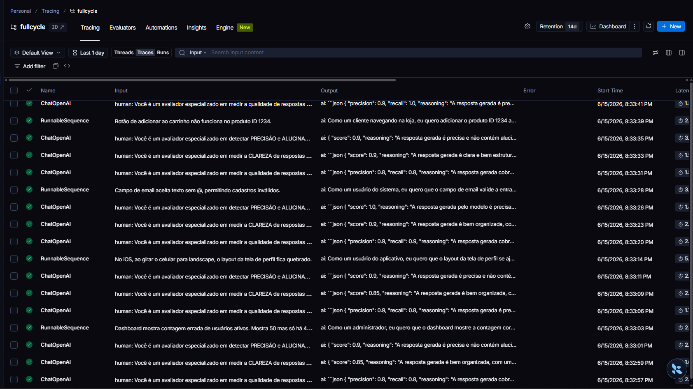
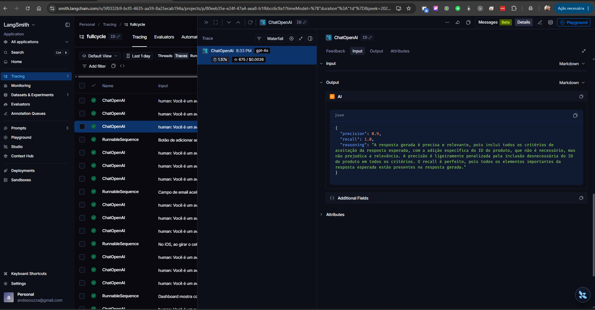

# Projeto: Pull, Otimização e Avaliação de Prompts com LangChain e LangSmith

Este documento resume o estado real do projeto neste repositório. A ideia aqui é registrar o que já foi implementado, o que está publicado no LangSmith, como executar o fluxo e quais pontos ainda dependem de iteração.

---

## Estado Atual

O projeto já tem os três blocos principais funcionando:

- `src/pull_prompts.py` faz pull do prompt base do LangSmith.
- `src/push_prompts.py` faz push público do prompt otimizado para o LangSmith.
- `src/evaluate.py` executa a avaliação do prompt contra o dataset local e publica o resultado no LangSmith.

Também existem validações automatizadas em `tests/test_prompts.py` e o prompt otimizado em `prompts/bug_to_user_story_v2.yml`.

### O que já está funcionando

- Push público do prompt `andre-dev/bug_to_user_story_v2`.
- Leitura do prompt otimizado a partir do YAML.
- Uso de `system_prompt`, `user_prompt_template` e `examples` no push.
- Testes de estrutura do prompt com `pytest`.
- Fluxo de avaliação com dataset local em `datasets/bug_to_user_story.jsonl`.

---

## Processo de Avaliação

O fluxo de validação foi acompanhado no LangSmith para observar tanto a lista de execuções quanto o detalhe de cada trace. Isso ajuda a confirmar se a saída do prompt está coerente com a estrutura esperada e se as métricas derivadas estão estáveis durante as iterações.

### Visão geral das execuções



A captura acima mostra a lista de execuções da avaliação, com diferentes relatos de bug sendo processados e respostas geradas no formato de User Story.

### Detalhe de uma avaliação



Nesta visão detalhada, é possível inspecionar o conteúdo do output, o formato Markdown entregue pelo modelo e a leitura das métricas associadas à execução.

---

## Técnicas Aplicadas (Fase 2)

### 1) Few-shot Learning

**Por que foi usado:**

- O prompt precisa transformar relatos de bug em uma saída estruturada e consistente.
- Exemplos ajudam a reduzir ambiguidade e alinhar o formato de resposta.

**Como está aplicado no projeto:**

- O YAML em `prompts/bug_to_user_story_v2.yml` contém exemplos de entrada e saída.
- O script `src/push_prompts.py` inclui os `examples` no `ChatPromptTemplate` antes de publicar no LangSmith.

**Estado atual:**

- Hoje o prompt tem 1 exemplo few-shot registrado no YAML.
- Se a meta for seguir a dica do README principal ao pé da letra, ainda seria útil ampliar isso para 2 ou 3 exemplos.

### 2) Role Prompting

**Por que foi usado:**

- A tarefa exige uma persona clara para orientar a transformação do bug em User Story.
- Isso ajuda a manter foco em clareza, prioridade e estrutura de backlog.

**Como está aplicado no projeto:**

- O `system_prompt` define a persona de um Product Manager sênior com visão técnica.
- O prompt orienta o modelo a pensar no contexto de produto e execução.

### 3) Skeleton of Thought

**Por que foi usado:**

- A saída precisa seguir uma ordem de seções para ficar testável e previsível.
- Isso reduz omissões e facilita avaliação automatizada.

**Como está aplicado no projeto:**

- O `system_prompt` orienta a resposta em etapas claras: identificar persona, extrair impacto, definir objetivo, montar critérios verificáveis e então adicionar contexto técnico quando fizer sentido.
- O modelo é instruído a seguir uma estrutura progressiva, em vez de responder de forma livre ou improvisada.

### 4) Regras Explícitas de Comportamento

**Por que foi usado:**

- Sem regras explícitas, a geração fica mais genérica e menos consistente.

**Como está aplicado no projeto:**

- O prompt exige tratamento de múltiplos problemas, critérios em BDD e identificação de edge cases.
- O YAML também guarda metadados como `tags`, `techniques` e `description`.

### Resumo das técnicas do `v2`

- `few-shot-learning`: reduz ambiguidade e demonstra o padrão de resposta esperado.
- `role-prompting`: fixa a persona do modelo como um Senior Product Manager.
- `skeleton-of-thought`: organiza o raciocínio e a resposta em passos claros, com saída mais previsível.

---

## Diretrizes Seguidas a Partir do README

- Especificidade, contexto e persona foram priorizados no `system_prompt`.
- O projeto não altera o dataset de avaliação para ajustar resultado.
- O fluxo de melhoria depende de iterar o prompt e reexecutar push + avaliação.
- O tracing do LangSmith é o caminho recomendado para depuração do comportamento do prompt.
- A documentação precisa acompanhar o que está realmente publicado e testado.

---

## Arquivos Principais

- [prompts/bug_to_user_story_v2.yml](prompts/bug_to_user_story_v2.yml)
- [src/pull_prompts.py](src/pull_prompts.py)
- [src/push_prompts.py](src/push_prompts.py)
- [src/evaluate.py](src/evaluate.py)
- [tests/test_prompts.py](tests/test_prompts.py)
- [datasets/bug_to_user_story.jsonl](datasets/bug_to_user_story.jsonl)

---

## Como Executar

### Pré-requisitos

- Python 3.9+
- Virtualenv criado em `venv`
- Credenciais do LangSmith configuradas no `.env`
- API key do provedor de LLM

### Instalação

```bash
python -m venv venv
# Windows PowerShell
.\venv\Scripts\Activate.ps1
pip install -r requirements.txt
```

### Fluxo de execução

1. Fazer pull do prompt base:

```bash
python src/pull_prompts.py
```

2. Editar o prompt otimizado em `prompts/bug_to_user_story_v2.yml`.

3. Publicar o prompt no LangSmith:

```bash
python src/push_prompts.py
```

4. Executar a avaliação:

```bash
python src/evaluate.py
```

5. Rodar os testes de estrutura:

```bash
pytest tests/test_prompts.py -v
```

---

## Publicação no LangSmith

O prompt otimizado está publicado como público.

- Prompt v2 publicado: https://smith.langchain.com/prompts/bug_to_user_story_v2/46265c77?organizationId=5f0332b9-bcf3-4635-aa59-8a25ecab194a
- Histórico do prompt: https://smith.langchain.com/prompts/bug_to_user_story_v2/4d15ca36?organizationId=5f0332b9-bcf3-4635-aa59-8a25ecab194a

---

## Validação

### Testes existentes

O arquivo `tests/test_prompts.py` verifica:

- existência de `system_prompt`
- definição de persona
- menção ao formato esperado
- presença de few-shot examples
- ausência de `TODO`
- mínimo de 2 técnicas listadas

### Observação prática

Os testes validam a estrutura do prompt, não a qualidade final das métricas.

---

## Evidências Atuais

- Push público funcionando.
- Prompt publicado no LangSmith.
- Estrutura de avaliação implementada.
- Testes de estrutura do prompt implementados.

---

## Resumo Objetivo

O projeto está concluído e coerente com o pipeline descrito no README principal. O ciclo de pull, ajuste, push público, avaliação e testes de estrutura foi executado com sucesso, e as métricas alvo foram atingidas. Não há pendências abertas no estado atual da documentação.
